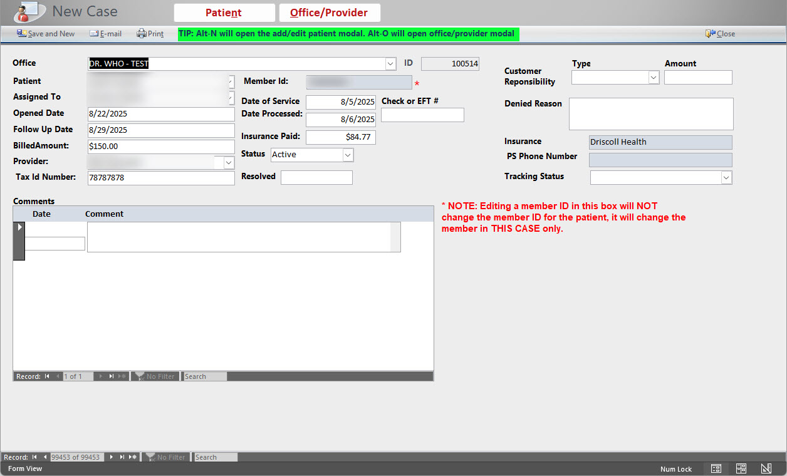

Microsoft Access Project Samples – Group 1 

This repository contains screenshots from a couple of recent Microsoft Access client projects (redacted and used with permission of clients). These projects highlight database design, user interface development, VBA automation, and reporting.
## One is an update (data and interface) of an Access 97 application for a crane equipment company.

##The other is a similar update done for a medical billing company.

